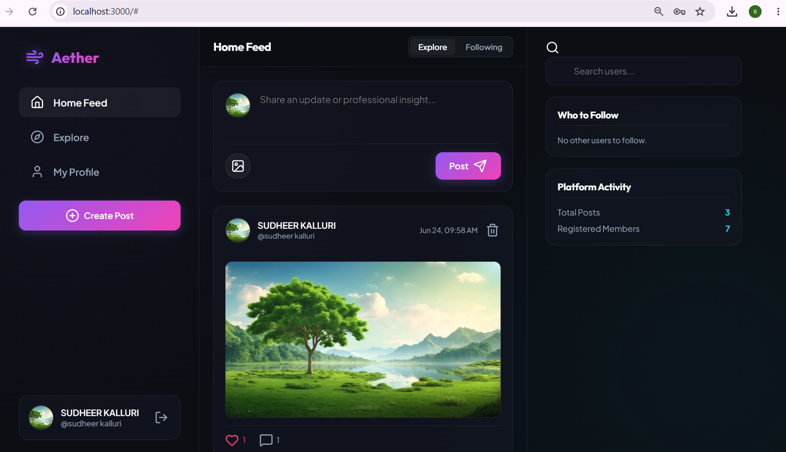
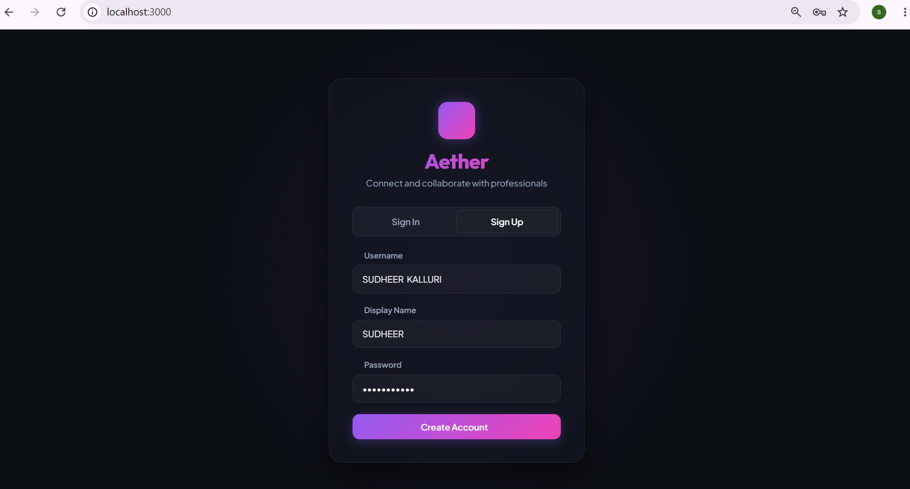
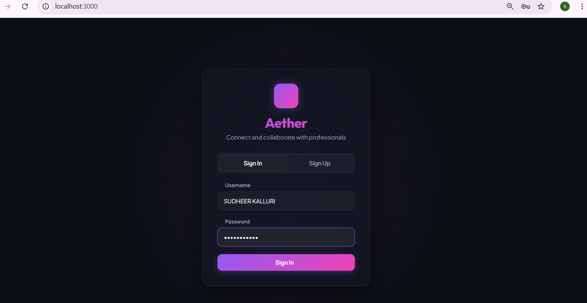
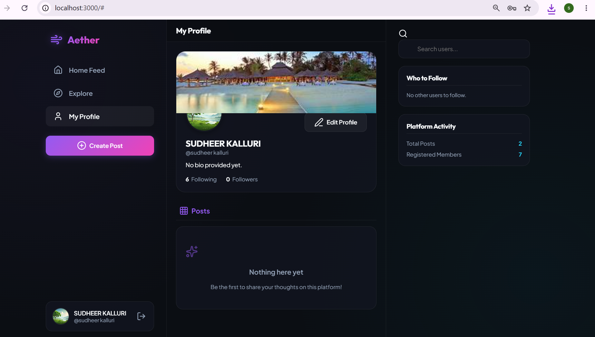
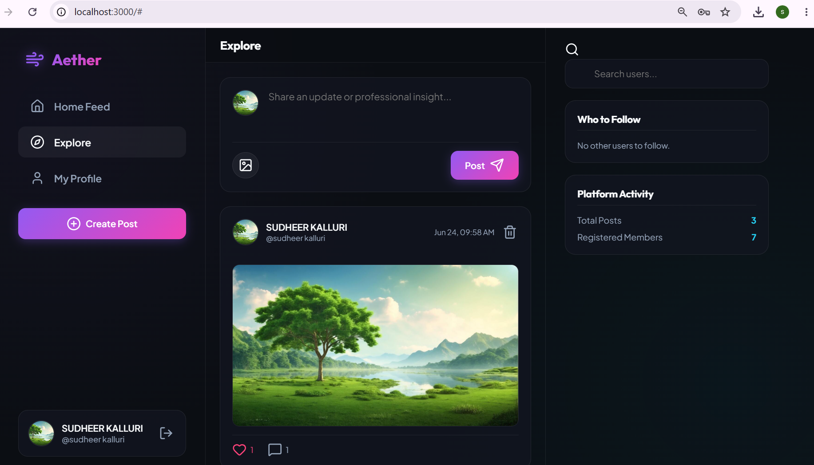

# 🌐 CodeAlpha Social Media Platform

## Full Stack Development Internship Project

### Internship Organization

**CodeAlpha**

### Internship Domain

**Full Stack Development**

### Task

**Task 2 – Social Media Platform**


# Project Description

The **Social Media Platform** is a full-stack web application developed using **Node.js** and **Express.js**. The platform allows users to create personal profiles, share posts, interact through comments, like posts, and follow other users. It demonstrates the implementation of modern web development concepts including frontend design, backend development, database integration, user authentication, and RESTful APIs.

The project was developed as part of the **CodeAlpha Full Stack Development Internship** to gain hands-on experience in building dynamic, interactive, and scalable web applications.


# Objectives

The primary objectives of this project are:

* Develop a complete social media web application.
* Implement secure user authentication.
* Create personalized user profiles.
* Allow users to create, edit, and delete posts.
* Enable commenting on posts.
* Implement Like and Follow functionalities.
* Store application data using a database.
* Build RESTful APIs using Express.js.
* Gain practical experience in Full Stack Development.


# Features Implemented

## User Authentication

* User Registration
* User Login
* User Logout
* Secure Password Storage
* Session Management

## User Profiles

* View Profile
* Edit Profile
* Profile Information
* User Bio
* Profile Picture Support

## Posts

* Create Posts
* View Posts
* Edit Posts
* Delete Posts

## Comments

* Add Comments
* View Comments
* Delete Comments

## Like System

* Like Posts
* Unlike Posts
* Like Counter

## Follow System

* Follow Users
* Unfollow Users
* Followers List
* Following List


# Database Integration

The application uses **JSON Database (db.json)** to store application data.

Database entities include:

## Users

* User ID
* Username
* Email
* Password
* Profile Information

## Posts

* Post ID
* Content
* Author
* Created Date

## Comments

* Comment ID
* Post ID
* User ID
* Comment Text

## Followers

* Follower ID
* Following ID


# Technology Stack

## Frontend

* HTML5
* CSS3
* JavaScript

## Backend

* Node.js
* Express.js

## Database

* JSON Database (db.json)

## Development Tools

* Visual Studio Code
* Git
* GitHub
* npm


# Software Requirements

* Node.js (v18 or above)
* npm (Node Package Manager)
* Visual Studio Code
* Git
* Modern Web Browser


# Project Architecture

```text
CodeAlpha_SocialMediaPlatform
│
├── .vscode
│
├── node_modules
│
├── public
│   ├── css
│   │   └── style.css
│   │
│   ├── js
│   │   ├── api.js
│   │   └── app.js
│   │
│   └── index.html
│
├── database.js
├── db.json
├── server.js
├── package.json
├── package-lock.json
└── README.md
```


# Installation and Setup

## Clone Repository

```bash
git clone https://github.com/yourusername/CodeAlpha_SocialMediaPlatform.git
```

## Navigate to Project Folder

```bash
cd CodeAlpha_SocialMediaPlatform
```

## Install Dependencies

```bash
npm install
```

## Run the Server

```bash
node server.js
```

If your project includes a **start** script in `package.json`, you can also run:

```bash
npm start
```

## Open in Browser

```text
http://localhost:3000
```

# Screenshots

## Home Feed



---

## Sign Up Page



---

## Sign In Page



---

## User Profile



---

## Explore Page



---

## Create Post


# Key Highlights

* User Registration and Login
* User Profile Management
* Post Creation and Management
* Comments on Posts
* Like System
* Follow/Unfollow Users
* RESTful API Development
* JSON Database Integration
* Responsive User Interface


# Learning Outcomes

Through this project, the following skills were acquired:

* Full Stack Web Development
* Node.js Fundamentals
* Express.js Framework
* REST API Development
* JavaScript Programming
* CRUD Operations
* Database Integration
* User Authentication
* Git & GitHub Version Control
* Responsive Web Design


# System Workflow

1. User opens the application.
2. User registers or logs in.
3. User updates their profile.
4. User creates a new post.
5. Other users can like and comment on the post.
6. Users can follow or unfollow other users.
7. All information is stored in the JSON database.
8. The server processes requests and returns dynamic responses.


# Future Enhancements

* Real-Time Chat
* Image Upload Support
* Video Sharing
* Notifications
* Search Functionality
* Hashtags
* Stories Feature
* Dark Mode
* Email Verification
* MongoDB Integration
* JWT Authentication
* Cloud Deployment


# Conclusion

The **Social Media Platform** demonstrates the development of a modern full-stack social networking application using **Node.js** and **Express.js**. The project integrates frontend technologies, backend logic, user authentication, RESTful APIs, and database management into a single functional application. It showcases practical knowledge of full-stack development and serves as an excellent portfolio project.


# Author

**Kalluri Siva Naga Sudheer**

**B.Tech – Computer Science and Engineering**

**Vignan's Foundation for Science, Technology and Research (Deemed to be University)**


# Internship Submission

**CodeAlpha Full Stack Development Internship**

**Task 2 – Social Media Platform**S